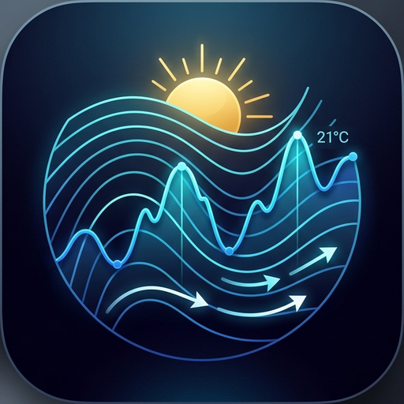

# MeteoNum 🌤️📊 — Publiczne Wydania

  

  <b>Nowoczesna aplikacja i widżet na system Android do przeglądania wielomodelowych numerycznych prognoz pogody (NWP).</b>

  
  
  

---

## 📲 Pobieranie (Najnowsza Wersja)

### [⬇️ Pobierz MeteoNum-v1.0.1-release.apk (Najnowsza wersja v1.0.1)](https://raw.githubusercontent.com/grindero/Releases/main/MeteoNum/MeteoNum-v1.0.1-release.apk)

* **Zawsze najnowsza wersja (stały link):**  
  [https://raw.githubusercontent.com/grindero/Releases/main/MeteoNum/MeteoNum-latest.apk](https://raw.githubusercontent.com/grindero/Releases/main/MeteoNum/MeteoNum-latest.apk)

### Metadane paczki:
* **Wersja:** `1.0.1` (versionCode: `2`)
* **Plik:** `MeteoNum-v1.0.1-release.apk`
* **Rozmiar:** 14.1 MB
* **Wymagania:** Android 8.0+ (API 26+)
* **Suma kontrolna (SHA-256):**  
  `206ef5f14224fb92b7e5b80d3aaddfcb53f9a11870301450fb91aa6a09029d3e`

---

## 📋 Historia Zmian (Changelog)

### [v1.0.1] — 24.09.2026
* **🚀 Perfekcyjnie płynne przewijanie (Relacja 1:1 z ruchem palca):**
  * **Pionowo:** Natywny rendering sprzętowy 120Hz GPU w WebView bez pośrednictwa JavaScript IPC. Pełna responsywność pod palcem z naturalną bezwładnością i fizyką Androida.
  * **Poziomo:** Synchronizacja wszystkich 9 wykresów meteogramu oraz górnej osi czasu przeskalowana wg zagęszczenia ekranu (`display density`), eliminując nadmierną czułość i wyrównując ruch do relacji 1:1.
  * **Optymalizacja DOM/CSS:** Wyłączenie blokujących zdarzeń dotykowych na canvasie wykresów (`pointer-events: none`, `touch-action: pan-y`) i usunięcie konfliktów podwójnego scrollowania.
* **🔄 Automatyzacja wydań CI/CD:**
  * Wdrożenie automatycznego budowania i publikowania podpisanych paczek APK do publicznego repozytorium `grindero/Releases` przy każdym wypchnięciu taga `v*`.
  * Generowanie uniwersalnego odnośnika `MeteoNum-latest.apk`.

### [v1.0.0] — 24.09.2026
* **Wielomodelowe prognozy numeryczne:**
  * **ICM UM 60h** (siatka mezoskalowa 4 km)
  * **ICM UM 120h** (siatka 4 km)
  * **NOAA GFS 240h** (prognoza globalna do 10 dni)
* **Interaktywny widok meteogramów:**
  * Zablokowana na stałe u góry oś czasu z datami, godzinami i strefami nocnymi.
  * Pełne wycięcie reklam i banerów zewnętrznych.
* **Klasyczne meteogramy siatkowe ICM** z zoomem pinch-to-zoom i legendą.
* **Widżet na pulpit Androida** z szybkim przełączaniem miejscowości (lewo/prawo).
* **Nowoczesna szata graficzna** w głębokim ciemnym motywie i dedykowana ikona NWP.

---

## 📦 Archiwum Wydań

| Wersja | Data | Plik APK | Suma SHA-256 |
|---|---|---|---|
| **v1.0.1** | 24.09.2026 | [MeteoNum-v1.0.1-release.apk](https://raw.githubusercontent.com/grindero/Releases/main/MeteoNum/MeteoNum-v1.0.1-release.apk) | `206ef5f1...9029d3e` |
| **v1.0.0** | 24.09.2026 | [MeteoNum-v1.0-release.apk](https://raw.githubusercontent.com/grindero/Releases/main/MeteoNum/MeteoNum-v1.0-release.apk) | `38aa560f...bf6f1bf1` |

---

## 🛠️ Jak zainstalować na telefonie?

1. Kliknij link **[Pobierz MeteoNum-v1.0.1-release.apk](https://raw.githubusercontent.com/grindero/Releases/main/MeteoNum/MeteoNum-v1.0.1-release.apk)** bezpośrednio na telefonie z Androidem.
2. Po zakończeniu pobierania otwórz powiadomienie o pobranym pliku (lub otwórz go w menedżerze plików w folderze *Pobrane* / *Download*).
3. Jeśli system zapyta o instalację aplikacji z nieznanych źródeł:
   * Wybierz **Ustawienia** → zaznacz **Zezwalaj z tego źródła** (dla przeglądarki Chrome lub Twojego menedżera plików).
4. Kliknij **Zainstaluj** (lub **Aktualizuj**, jeśli masz już wersję 1.0.0).
5. Gotowe!
